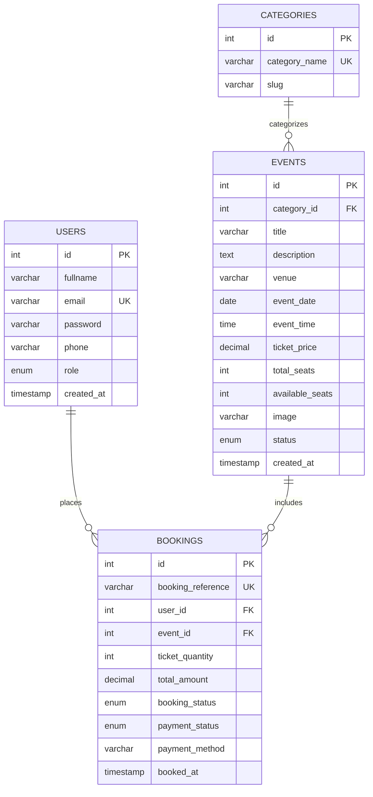

# ACADEMIC PROJECT REPORT & VIVA DEFENSE GUIDE

## Bhakti Events — Royal Indian Event Management & Pass Reservation System
*(Production Web Platform for Bhakti Creation, Gondal & BCA Semester 5 Academic Project)*

**Academic Year:** 2026  
**Course:** Bachelor of Computer Applications (BCA) — Semester 5  
**Subject:** Major Web Project / Relational Database Systems (RDBMS)  
**Commercial Deployment:** Bhakti Events & Celebrations, Tirumala Shopping Mall, Gundala Darwaja, Gondal, Gujarat

---

### Student & Mentorship Credentials

| Parameter | Details |
| :--- | :--- |
| **Student Name** | Parmar Ankita Pankajbhai |
| **Enrollment Number** | `24CS002UG01020` |
| **Project Guide / Supervisor** | Prof. Aryan More |
| **Client / Real-World Sponsor** | Bhakti Creation (Bhakti Events & Celebrations &bull; Est. 2014) |
| **Institution** | Department of Computer Applications |
| **Technology Stack** | PHP 8.2 (PDO), MySQL/MariaDB (3NF), Royal Vanilla CSS3 Design System, JavaScript ES6 |

---

## 1. Executive Summary & Problem Statement

### 1.1 Problem Statement
Traditional Indian event and wedding planning firms rely on fragmented WhatsApp chats, physical diary entries, and manual cash receipts. This causes:
1. **High Risk of Overbooking & Miscommunication**: In high-profile weddings and festival garba celebrations, multiple coordinators allocating VIP passes simultaneously leads to seat conflicts and double-bookings.
2. **Delayed Pass Delivery**: Guests must collect physical entry cards or wait for manual confirmations.
3. **Absence of Real-Time Operations Control**: Coordinators lack live visibility into pass inventory, gross revenue collections, and attendee directories.

### 1.2 Proposed Solution: Bhakti Events Web Platform
Bhakti Events bridges high-end Indian royal event aesthetics with commercial software reliability:
- Guests can browse authentic curated celebrations (palace destination weddings, candlelit Sufi mehfils, Navratri Garba, and corporate banquets), inspect royal venues, calculate pass pricing, and reserve guaranteed passes with instant E-Ticket barcode issuance.
- Pass checkout is fortified with database-level row locking (`SELECT ... FOR UPDATE`), ensuring zero overselling under heavy concurrency.
- Administrators possess a dedicated Royal Operations Console featuring live Gujarat digital clocks, customer WhatsApp concierge integrations, event CRUD with photography uploads, and CSV auditing export.

---

## 2. Database Architecture & Relational Normalization (3NF)

The database schema (`events_db`) is designed in Third Normal Form (3NF) to guarantee referential integrity and eliminate anomalies.

### 2.1 Table Structure & Constraints



### 2.2 Normalization Justification
1. **First Normal Form (1NF)**: Each table field contains atomic values with primary keys (`id`).
2. **Second Normal Form (2NF)**: All non-key attributes are fully dependent on the primary key without partial dependencies.
3. **Third Normal Form (3NF)**: Transitive dependencies are removed by decoupling event categories (`categories`) and guest profiles (`users`) from transaction entries (`bookings`).

---

## 3. Concurrency Protection & Security Architecture

### 3.1 Overbooking Prevention via ACID Transactions & Row-Level Lock
When an attendee reserves passes in `book-ticket.php`:
```php
// Begin ACID transaction
$pdo->beginTransaction();

try {
    // 1. Acquire exclusive row-level lock on the event record
    $stmt = $pdo->prepare("SELECT ticket_price, available_seats FROM events WHERE id = ? FOR UPDATE");
    $stmt->execute([$eventId]);
    $event = $stmt->fetch();

    if ($event['available_seats'] < $requestedTickets) {
        $pdo->rollBack();
        die("Insufficient passes available.");
    }

    // 2. Insert booking record
    // 3. Decrement available seats
    $pdo->prepare("UPDATE events SET available_seats = available_seats - ? WHERE id = ?")
        ->execute([$requestedTickets, $eventId]);

    // Commit changes atomically
    $pdo->commit();
} catch (Exception $e) {
    $pdo->rollBack();
}
```

**Technical Explanation for Evaluator**:  
The `FOR UPDATE` clause instructs MySQL InnoDB to acquire an exclusive lock on that specific row. Any simultaneous checkout attempt for the same celebration must wait until the active transaction commits. This guarantees that race conditions cannot decrement the inventory below zero.

### 3.2 Security Measures
1. **Password Hashing**: Bcrypt via `password_hash($pass, PASSWORD_BCRYPT)` and verification with `password_verify()`.
2. **SQL Injection Defense**: 100% of database queries utilize PDO Prepared Statements with parameterized inputs.
3. **Cross-Site Scripting (XSS) Prevention**: User-supplied data is escaped through `htmlspecialchars(..., ENT_QUOTES, 'UTF-8')`.
4. **Session Guards**: Role-based access control (`require_login()`, `require_admin()`).

---

## 4. Top 10 Viva Voce Questions & Evaluator Defense

### Q1: What is the real-world purpose of the Bhakti Events project?
**Answer:** "Bhakti Events is an end-to-end event management and royal pass reservation system customized for Bhakti Creation in Gondal, Gujarat. It allows guests to discover heritage celebrations, book verified passes, and communicate directly with event directors via WhatsApp, while giving management complete inventory control."

### Q2: How does your system prevent two users from booking the same last ticket simultaneously?
**Answer:** "We use MySQL InnoDB transactions with a `SELECT ... FOR UPDATE` row-level exclusive lock in `book-ticket.php`. This serializes concurrent requests on that specific event row, ensuring available seats are evaluated and decremented atomically. If insufficient seats remain, the transaction rolls back cleanly."

### Q3: Why did you choose PDO over MySQLi?
**Answer:** "PDO (PHP Data Objects) supports multiple database drivers, provides unified exception handling (`PDOException`), natively disables emulated prepares for robust SQL injection prevention, and allows clean associative array mapping."

### Q4: Explain the role of the Bcrypt algorithm in your application.
**Answer:** "We use PHP's `password_hash()` with `PASSWORD_BCRYPT`. Bcrypt incorporates an adaptive work factor (salt + multi-round key derivation) making it highly resistant against dictionary and rainbow-table attacks."

### Q5: How is your database normalized to 3NF?
**Answer:** "Every column stores atomic values (1NF). Non-key fields are strictly dependent on primary keys without partial dependency (2NF). Transitive dependencies are eliminated by separating categories, events, users, and bookings into dedicated relational tables linked by foreign keys (3NF)."

### Q6: How does the E-Ticket printing function without third-party PDF libraries?
**Answer:** "We implemented custom `@media print` CSS rules in `responsive.css`. When the user clicks 'Print / Save Royal E-Pass', the browser executes `window.print()`, hiding navigation bars, action buttons, and page backgrounds while formatting the vector barcode and pass details cleanly for A4 paper."

### Q7: What happens when an attendee or administrator cancels a booking?
**Answer:** "The cancellation logic updates the booking status to 'Cancelled' and automatically increments the celebration's `available_seats` counter by the reserved quantity inside an ACID transaction, immediately returning passes to available inventory."

### Q8: How did you implement live search and filtering in the admin console?
**Answer:** "In `assets/js/admin.js`, an `input` event listener is attached to `#tableSearch` and `#statusFilter`. On each keystroke, the JavaScript filter evaluates row content dynamically and toggles CSS `display` without reloading the webpage."

### Q9: What happens if the database is not imported into phpMyAdmin before running the project?
**Answer:** "Our `config/db.php` includes an auto-provisioning exception handler. If error 1049 ('Unknown database') is caught, it automatically executes `CREATE DATABASE IF NOT EXISTS events_db` and loads the initial schema and seeds from `database.sql`."

### Q10: What are the student and guide credentials associated with this submission?
**Answer:** "The project is engineered by **Parmar Ankita Pankajbhai** (Enrollment: `24CS002UG01020`) under the guidance of **Prof. Aryan More** for the BCA Semester 5 Major Project."

---

*Report prepared and validated for BCA Semester 5 Examination.*
