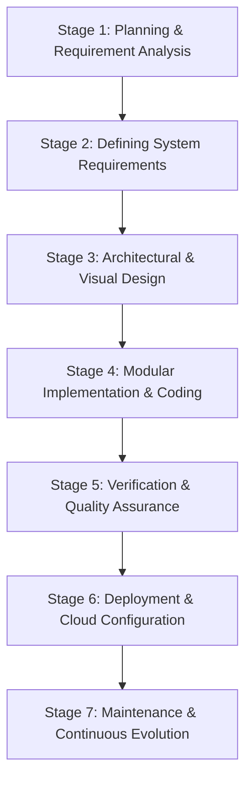
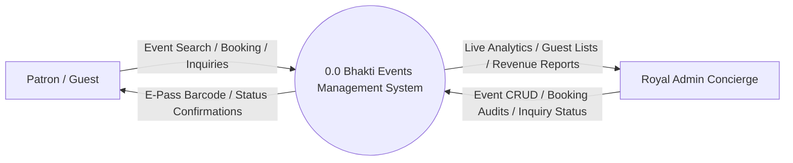
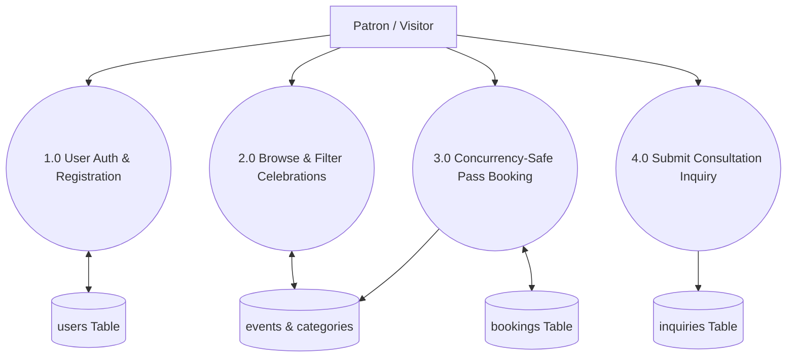
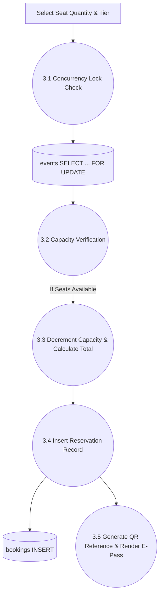
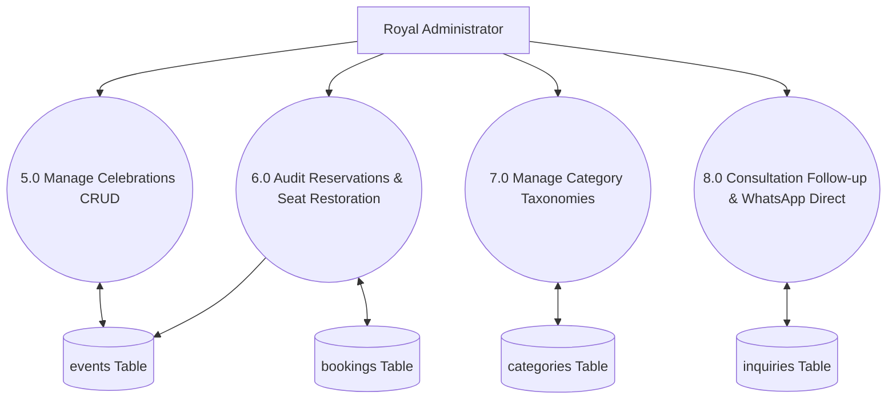
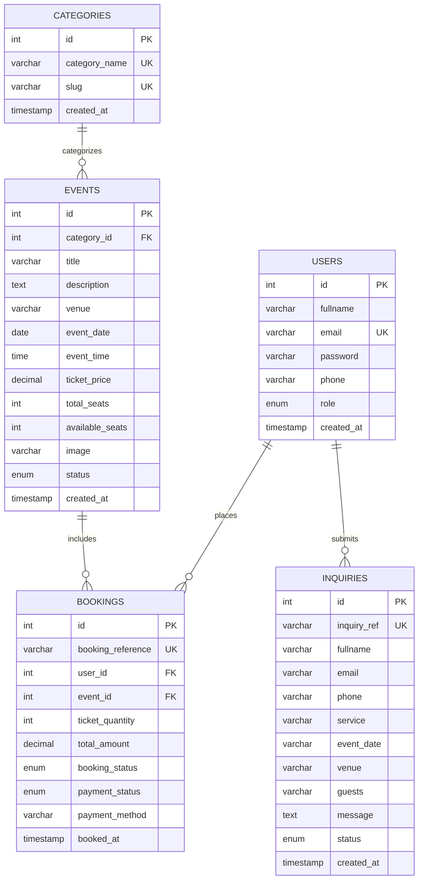
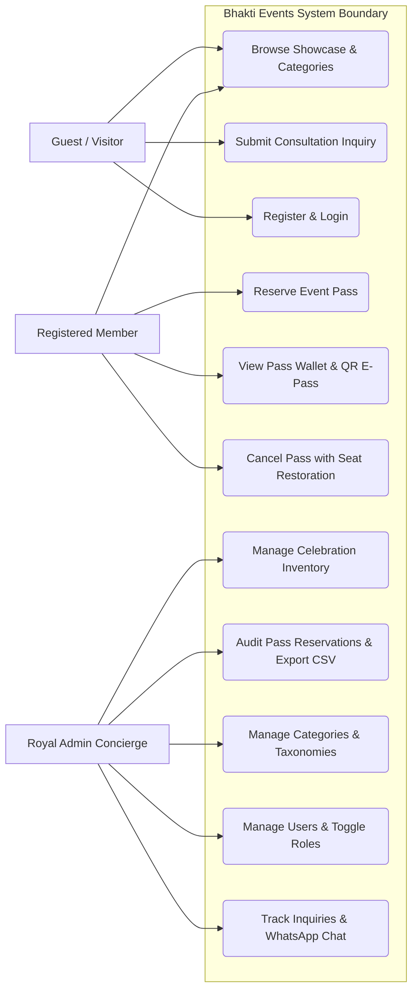

# A PROJECT REPORT ON
# Bhakti Events & Celebrations
## Online Event Management & Ticketing System

**Submitted to:** Saurashtra University, Rajkot  
**In Partial Fulfillment of 6th Semester of:** Bachelor of Computer Application (B.C.A.)  
**Academic Year:** 2024–2025  

---

### Student & Institution Credentials

| Parameter | Details |
| :--- | :--- |
| **Project Title** | Bhakti Events & Celebrations — Online Event Management & Ticketing System |
| **Course** | Bachelor of Computer Application (B.C.A.) — Semester 6 |
| **Submitted By** | Parmar Ankita Pankajbhai / Ayush Kavathiya |
| **Enrollment Number** | `24CS002UG01020` |
| **Institution** | Sahajanand College of IT & Management - Gondal |
| **Affiliated University** | Saurashtra University, Rajkot |
| **Project Guide** | Prof. Urvisha Mor (Department of Computer Science) |
| **Client / Organization** | Bhakti Events & Celebrations (Est. 2014, Gondal, Gujarat) |
| **Technology Stack** | PHP 8.2 (OOP & PDO), MySQL 8.0 / MariaDB, Vanilla CSS3 Design System, JavaScript ES6 |

---

## Index / Table of Contents

| Sr. No. | Title | Page No. |
| :---: | :--- | :---: |
| 01 | [Acknowledgement](#01-acknowledgement) | 3 |
| 02 | [Abstract](#02-abstract) | 4 |
| 03 | [Introduction of Project](#03-introduction-of-project) | 5 |
| 04 | [Project Description](#04-project-description) | 6 |
| 05 | [Feasibility Study](#05-feasibility-study) | 8 |
| 06 | [Data Dictionary](#06-data-dictionary) | 11 |
| 07 | [Table Normalization](#07-table-normalization) | 14 |
| 08 | [SDLC (Software Development Life Cycle)](#08-sdlc-software-development-life-cycle) | 15 |
| 09 | [DFD (Data Flow Diagram)](#09-dfd-data-flow-diagram) | 20 |
| 10 | [E-R Diagram](#10-e-r-diagram) | 24 |
| 11 | [Use Case Diagram](#11-use-case-diagram) | 27 |
| 12 | [Screenshots & Module Walkthrough](#12-screenshots--module-walkthrough) | 29 |
| 13 | [Software Testing](#13-software-testing) | 35 |
| 14 | [Project Implementation & Deployment](#14-project-implementation--deployment) | 40 |
| 15 | [Bibliography & References](#15-bibliography--references) | 41 |

---

## 01. Acknowledgement

I feel a deep sense of pleasure and accomplishment in submitting this project, **“Bhakti Events & Celebrations — Online Event Management & Ticketing System”**, which was developed under the academic curriculum of Saurashtra University. While theoretical study is exposed within the four walls of the classroom, the practical design, full-stack implementation, and deployment of a commercial-grade event ticketing platform has been a genuinely enriching experience.

I would like to express my deepest gratitude to the esteemed faculties and management of **“Sahajanand College of IT & Management - Gondal”** for placing their trust in me with such an expansive and contemporary project. I heartily thank them for spending their valuable time, providing continuous technical mentoring, and encouraging modern architectural approaches throughout the development cycle.

I am deeply thankful to our Computer Science Department for providing robust computer laboratory facilities, server infrastructure, and developer utilities. Special thanks to our honorable **Principal Sir and project guide Prof. Urvisha Mor** for their motivating guidance, critical reviews, and suggestions on standard enterprise design patterns.

Last but not least, I am greatly thankful to my family and colleagues who directly or indirectly supported and inspired me towards the successful completion of this project.

*Thank You All.*

---

## 02. Abstract

The primary objective of the **Bhakti Events & Celebrations Online Event Management System** is to revolutionize how cultural celebrations, royal weddings, musical mehfils, corporate summits, and cultural galas are organized, reserved, and managed in Gondal and throughout Gujarat.

In today's fast-paced digital era, traditional manual methods of booking event tickets, issuing paper passes, managing guest lists, and tracking seating capacities are prone to severe operational inefficiencies, ticket duplication, and delayed communication. The Bhakti Events System presents a comprehensive web-based platform tailored to bridge the gap between event organizers and attendees.

The solution delivers a dual-panel ecosystem comprising a Public Guest & Patron Portal and a Royal Concierge Administrator Console:

- **Guest & Patron Experience:** Browse active celebrations by heritage category, select tailored pass tiers (*Royal Pass*, *Gold Circle*, *Shahi Diwan VIP Lounge*), view real-time venue coordinates, execute concurrency-safe instant reservations, and receive scannable QR E-Pass vouchers.
- **Royal Concierge Administration:** Real-time revenue yield analytics, SVG monthly influx visualization, celebration inventory management, pass auditing with WhatsApp attendee integration, dynamic taxonomy classification, registered user directory with role access controls, and a dedicated consultation inquiry directorship.

Built with an emphasis on high aesthetic excellence (Royal Burgundy `#7A1C2E` & Imperial Gold `#C5A059`), ACID database transactions with row-level locking (`SELECT ... FOR UPDATE`), and responsive web standards, the system guarantees zero-overbooking integrity and seamless guest hospitality.

---

## 03. Introduction of Project

In contemporary society, individuals and corporate entities manage demanding daily schedules, making in-person visits to event booking counters and manual ticket reservations inconvenient and obsolete. Organizers face equal hurdles tracking physical paper registers, tallying cash counter receipts, and coordinating with attendees.

**Bhakti Events & Celebrations** (established in 2014, operating from Tirumala Shopping Mall, Gundala Darwaja, Gondal, Gujarat) has earned renown for curating royal destination weddings, Navratri cultural garbas, Sufi musical concerts, corporate leadership banquets, and youth conclaves. To match their expanding patron base, this web-based event management system was developed to provide an end-to-end digital reservation and guest coordination suite.

The application is developed utilizing PHP 8.x, MySQL relational database on the Apache HTTP server, with a semantic HTML5, Vanilla CSS3, and modern JavaScript frontend. Users can easily discover celebrations, select customized seat tiers, and complete reservations within sixty seconds from any device.

### Key System Modules:
1. **Public Showcase & Catalog Module:** Interactive exploration of heritage events with dates, timings, venues, and ticket contribution rates.
2. **Patron Booking & Digital Pass Wallet:** Concurrency-safe ticket reservation engine with unique QR reference generation and printable E-Passes.
3. **Royal Consultation & Inquiry Atelier:** Bespoke event planning requests submitted directly to the directorship with inquiry tracking.
4. **Administrator Operations Console:** Executive dashboard featuring revenue charts, pass lifecycle audit (Confirm, Cancel with safe seat restoration), category taxonomy, user directory with admin privilege toggling, and consultation follow-ups with one-click WhatsApp client direct-chat.

---

## 04. Project Description

### Project Profile

| Parameter | Specification |
| :--- | :--- |
| **Project Title** | Bhakti Events & Celebrations — Online Event Management & Ticketing System |
| **Project Type** | Full-Stack Web Application (E-Commerce & Event Management) |
| **Target Organization** | Bhakti Events & Celebrations (Est. 2014, Gondal, Gujarat) |
| **Backend Technology** | PHP 8.2 (Modular OOP & PDO Architecture) |
| **Database Server** | MySQL 8.0 / MariaDB on XAMPP |
| **Frontend Technology** | HTML5, CSS3 (Vanilla Design System), JavaScript (ES6+), FontAwesome 6 |

### Existing System:
- **Manual Paper Logbooks:** Organizers maintain physical register books for pass sales and attendee contacts, which are vulnerable to damage and loss.
- **High Time Consumption:** Verifying seat availability, tallying receipts, and calculating occupancy takes significant time and human effort.
- **Inability to Handle Concurrency:** Multiple sales desks booking simultaneously often leads to inadvertent double-booking and seat over-allocation.
- **Physical Presence Mandatory:** Patrons must travel to physical booking counters to collect tickets or make inquiries.
- **Inefficient Analytics:** Evaluating seasonal revenue yield and historical occupancy requires laborious manual arithmetic.

### Need for New System:
- **24/7 Web Access:** Patrons can browse events, book passes, and download E-Passes from any mobile or desktop browser anytime.
- **Zero Overbooking (ACID Transactions):** Employs database row-level locking (`SELECT ... FOR UPDATE`) guaranteeing that available seats decrement reliably.
- **Reduced Paperwork & Overhead:** Eliminates paper passes by generating digital QR vouchers with printable stylesheets.
- **Automated Real-Time Analytics:** Executive dashboard displays gross revenue, live occupancy rates, and visual monthly sales trends.
- **Integrated Patron Communication:** Instant one-click WhatsApp concierge messaging directly links organizers with event attendees.

---

## 05. Feasibility Study

A Feasibility Study evaluates the operational viability, financial prudence, and technical sustainability of a proposed software system prior to full-scale deployment. The analysis examines five core feasibility areas:

1. **Technical Feasibility:** Evaluates whether the chosen technology stack (PHP 8, MySQL, Apache, modern web standards) is capable of delivering the required features. The development environment uses proven, open-source web technologies available on any standard server environment. Maintenance, scalability, and security updates are straightforward.
2. **Operational Feasibility:** Assesses usability and operational ease for both non-technical patrons and administrative personnel. The user interface incorporates high visual clarity, self-explanatory forms, intuitive status badges, and prominent action buttons requiring zero formal training.
3. **Economic Feasibility:** Compares development and operational expenditure against organizational returns. By leveraging open-source technologies (PHP, MySQL, Apache XAMPP), software licensing costs are zero. The system substantially cuts paper printing costs, physical counter staffing, and administrative overhead.
4. **Schedule Feasibility:** Evaluates project delivery milestones against strict academic and deployment schedules. The modular development structure enabled agile design, prototyping, coding, and testing phases within the designated timeline.
5. **Market & Resource Feasibility:** Confirms strong market demand for digital event ticketing in Tier-2 and Tier-3 cultural hubs like Gondal and Rajkot. Human and hardware resources required to operate the system are readily available.

### Hardware & Software Requirements

#### Client-Side Requirements:
- **Processor:** Dual-Core 1.6 GHz or higher
- **RAM:** 2 GB minimum (4 GB recommended)
- **Display:** 1024 x 768 or higher (Responsive on mobile screens 360px+)
- **Web Browser:** Google Chrome 90+, Mozilla Firefox 88+, Microsoft Edge, Safari

#### Server-Side Requirements:
- **Operating System:** Windows 10/11 / Linux (Ubuntu 20.04+) / macOS
- **Web Server:** Apache 2.4.x (HTTP Server with mod_rewrite)
- **Runtime Engine:** PHP 8.1 / 8.2 (PDO, pdo_mysql, session, gd enabled)
- **Database Server:** MySQL 8.0+ / MariaDB 10.4+
- **Development Environment:** XAMPP / WAMP Suite

---

## 06. Data Dictionary

The Data Dictionary provides a detailed specification of the relational database schema, detailing table structures, attributes, data types, field constraints, and functional descriptions within the MySQL database (`events_db`).

### Table 1: `users` (System Users & Patrons)

| Field | Type | Size | Constraints | Description |
| :--- | :--- | :--- | :--- | :--- |
| `id` | INT | 11 | Primary Key, Auto Inc | Unique user identifier |
| `fullname` | VARCHAR | 100 | NOT NULL | Full legal name of user |
| `email` | VARCHAR | 100 | NOT NULL, UNIQUE | Account email address |
| `password` | VARCHAR | 255 | NOT NULL | Secure BCRYPT password hash |
| `phone` | VARCHAR | 20 | NULL | Contact phone / WhatsApp number |
| `role` | ENUM | 'user','admin' | DEFAULT 'user' | System authorization role |
| `created_at` | TIMESTAMP | -- | CURRENT_TIMESTAMP | Registration timestamp |

### Table 2: `categories` (Celebration Taxonomies)

| Field | Type | Size | Constraints | Description |
| :--- | :--- | :--- | :--- | :--- |
| `id` | INT | 11 | Primary Key, Auto Inc | Unique category identifier |
| `category_name` | VARCHAR | 100 | NOT NULL, UNIQUE | Name of royal category theme |
| `slug` | VARCHAR | 120 | NOT NULL, UNIQUE | URL-friendly SEO slug |
| `created_at` | TIMESTAMP | -- | CURRENT_TIMESTAMP | Category creation date |

### Table 3: `events` (Celebrations & Galas)

| Field | Type | Size | Constraints | Description |
| :--- | :--- | :--- | :--- | :--- |
| `id` | INT | 11 | Primary Key, Auto Inc | Unique celebration identifier |
| `category_id` | INT | 11 | Foreign Key (`categories`) | Associated category ID |
| `title` | VARCHAR | 200 | NOT NULL | Celebration title / headline |
| `description` | TEXT | -- | NOT NULL | Hospitality narrative & details |
| `venue` | VARCHAR | 200 | NOT NULL | Palace / hall venue address |
| `event_date` | DATE | -- | NOT NULL | Scheduled celebration date |
| `event_time` | TIME | -- | NOT NULL | Commencement time |
| `ticket_price` | DECIMAL | 10,2 | NOT NULL | Base contribution pass price |
| `total_seats` | INT | 11 | NOT NULL | Total sanctioned pass capacity |
| `available_seats`| INT | 11 | NOT NULL | Remaining available passes |
| `image` | VARCHAR | 255 | DEFAULT 'default.jpg' | Banner photograph filename |
| `status` | ENUM | 'upcoming','completed','cancelled' | DEFAULT 'upcoming' | Lifecycle status of event |
| `created_at` | TIMESTAMP | -- | CURRENT_TIMESTAMP | Publish timestamp |

### Table 4: `bookings` (Pass Reservations)

| Field | Type | Size | Constraints | Description |
| :--- | :--- | :--- | :--- | :--- |
| `id` | INT | 11 | Primary Key, Auto Inc | Unique reservation record ID |
| `booking_reference` | VARCHAR | 30 | NOT NULL, UNIQUE | Unique alphanumeric voucher ref |
| `user_id` | INT | 11 | Foreign Key (`users`) | Guest patron user ID |
| `event_id` | INT | 11 | Foreign Key (`events`) | Reserved celebration ID |
| `ticket_quantity` | INT | 11 | NOT NULL | Number of passes booked |
| `total_amount` | DECIMAL | 10,2 | NOT NULL | Total INR pass contribution |
| `booking_status` | ENUM | 'Confirmed','Pending','Cancelled' | DEFAULT 'Confirmed' | Lifecycle booking status |
| `payment_status` | ENUM | 'Paid','Pending','Refunded' | DEFAULT 'Paid' | Financial settlement state |
| `payment_method` | VARCHAR | 50 | DEFAULT 'Online' | Payment gateway or method |
| `booked_at` | TIMESTAMP | -- | CURRENT_TIMESTAMP | Reservation booking timestamp |

### Table 5: `inquiries` (Client Consultations)

| Field | Type | Size | Constraints | Description |
| :--- | :--- | :--- | :--- | :--- |
| `id` | INT | 11 | Primary Key, Auto Inc | Unique consultation inquiry ID |
| `inquiry_ref` | VARCHAR | 30 | NOT NULL, UNIQUE | Official tracking reference code |
| `fullname` | VARCHAR | 100 | NOT NULL | Patron full contact name |
| `email` | VARCHAR | 100 | NOT NULL | Patron email address |
| `phone` | VARCHAR | 25 | NOT NULL | Patron phone / WhatsApp number |
| `service` | VARCHAR | 120 | NOT NULL | Requested event service type |
| `event_date` | VARCHAR | 50 | NULL | Tentative season / date |
| `venue` | VARCHAR | 200 | NULL | Preferred venue tier or palace |
| `guests` | VARCHAR | 50 | NULL | Estimated guest attendance |
| `message` | TEXT | -- | NOT NULL | Vision statement & requirements |
| `status` | ENUM | 'New','Contacted','Proposal Sent','Confirmed','Closed' | DEFAULT 'New' | Directorship workflow state |
| `created_at` | TIMESTAMP | -- | CURRENT_TIMESTAMP | Submission timestamp |

---

## 07. Table Normalization

Normalization is an essential database design procedure that organizes relational table attributes to eliminate data redundancy, enforce referential integrity, and optimize storage efficiency. An un-normalized database often suffers from three critical data anomalies:

1. **Insertion Anomalies:** Occur when it is impossible to record certain information without artificially recording unrelated data. In our system, events can exist independently of bookings, and categories exist independently of events.
2. **Deletion Anomalies:** Occur when the deletion of one data entity inadvertently wipes out essential unrelated data. For example, cancelling a user booking does not delete the event celebration or user account record.
3. **Updation Anomalies:** Occur when duplicate data across multiple records becomes inconsistent during modifications. By maintaining single authoritative source tables for users and events, updating an event venue updates all linked vouchers simultaneously.

### Normalization Stages Applied to Bhakti Events Database:
- **First Normal Form (1NF):** All attributes contain atomic (indivisible) values. There are no repeating groups or multivalued attributes. Each table contains a unique primary key (`id`).
- **Second Normal Form (2NF):** The database meets 1NF criteria and all non-key attributes are fully functionally dependent on the entire primary key, eliminating partial dependency.
- **Third Normal Form (3NF):** The database satisfies 2NF criteria and eliminates all transitive dependencies; non-primary attributes do not depend on other non-primary attributes. User data, event data, category data, and transaction data reside in distinct normalized relations linked strictly by foreign keys.

---

## 08. SDLC (Software Development Life Cycle)

The Software Development Life Cycle (SDLC) is a structured methodology followed by software engineering teams to design, develop, test, and maintain high-quality software systems. The Bhakti Events System was engineered following the **Classical Waterfall Model with Agile iterative testing** across seven distinct stages:

- **Stage 1: Planning & Requirement Analysis:** Gathered functional expectations from event organizers and patrons. Analyzed concurrency demands during Navratri ticket releases and identified core transaction requirements, resulting in the Software Requirement Specification (SRS).
- **Stage 2: Defining System Requirements:** Documented user journeys, authorization rules, payment modes, seat restoration logic, and client consultation workflows. Validated feasibility, timeline, and academic evaluation requirements.
- **Stage 3: Architectural & Visual Design:** Designed the system architecture, entity relationships (ER), data dictionaries, and royal visual styling (Royal Burgundy `#7A1C2E` & Imperial Gold `#C5A059`) adhering to agency-grade UI/UX benchmarks.
- **Stage 4: Modular Implementation & Coding:** Implemented backend business logic using PHP 8 and MySQL PDO. Built the public discovery portal, ACID reservation engine, user pass wallet, and royal concierge administrative console.
- **Stage 5: Verification & Quality Assurance:** Subjected the codebase to rigorous White Box, Black Box, and Gray Box testing. Verified SQL injection defense, concurrency locking, XSS sanitization, and responsive layout fidelity.
- **Stage 6: Deployment & Cloud Configuration:** Configured Apache virtual hosts, environment variables for cloud portability, output buffering, and localtunnel/cloud deployment scripts.
- **Stage 7: Maintenance & Continuous Evolution:** Ensures data backup routines, server monitoring, feedback integration, and continuous enhancements to celebration catalogs.

---

## 09. DFD (Data Flow Diagram)

A Data Flow Diagram (DFD) provides a graphical representation of the flow of data through an information system, modeling its process aspects in terms of inputs, data stores, internal transformations, and system outputs.

### Standard DFD Notations:

| DFD Component | Symbol Representation | Functional Description |
| :--- | :---: | :--- |
| **Process** | Circle / Rounded Rectangle | Represents a functional transformation or operation performed by the system. |
| **External Entity** | Square / Rectangle | Represents an external actor (Guest, Patron, Admin) interacting with the system. |
| **Data Flow** | Directed Arrow (`-->`) | Represents the path and direction in which information packets travel. |
| **Data Store** | Open Rectangle / Parallel Lines | Represents a database repository or file where data is persisted. |

### Context Level DFD (Level 0)

### 1st Level DFD (User Subsystems)

### 2nd Level DFD (Booking Subsystem)

### Admin Side DFD

---

## 10. E-R Diagram

The Entity-Relationship (ER) Model is a conceptual data modeling blueprint that portrays the logical architecture of a database through entities, attributes, and cardinality relationships.

### ER Modeling Symbols Used:
- **Rectangles:** Represent entity sets (`users`, `categories`, `events`, `bookings`, `inquiries`).
- **Ellipses / Attributes:** Represent entity fields (e.g. `title`, `ticket_price`, `booking_reference`).
- **Diamonds / Relationships:** Represent active associations between entities (e.g. *Places*, *Categorizes*, *Includes*).
- **Underlined Attributes:** Primary Key identifiers (`id`, `booking_reference`).

### Complete Entity-Relationship Diagram

### Core Cardinality Analysis:
- **Categories to Events (1 : N):** One royal category encompasses multiple celebrations. Each celebration belongs to exactly one category.
- **Users to Bookings (1 : N):** One registered patron can reserve multiple event passes over time. Each booking is assigned to one user.
- **Events to Bookings (1 : N):** One celebration can accommodate multiple patron bookings up to its total capacity.
- **Users to Inquiries (1 : N):** Prospective clients can submit multiple celebration consultation inquiries.

---

## 11. Use Case Diagram

A Use Case Diagram in Unified Modeling Language (UML) depicts the dynamic behavioral relationship between external actors and system use cases, delineating system boundaries and user capabilities.

### Primary System Actors & Capabilities:

1. **Guest / Visitor Patron (Unauthenticated):**
   - Browse celebration showcase & filter by category
   - View celebration inclusions, pricing, and venue coordinates
   - Submit bespoke event inquiries via contact atelier
   - Register new patron account & sign in
2. **Registered Member Patron (Authenticated):**
   - Reserve celebration passes with tier selection
   - View personal Pass Wallet with status tracking
   - Print verifiable E-Pass voucher with QR barcode
   - Update personal profile info and modify account password
   - 1-Click switch to Administrator console (authorized roles)
3. **Royal Concierge Administrator:**
   - View executive analytics & monthly revenue influx chart
   - Publish, edit, and delete celebrations with photography upload
   - Audit pass bookings, confirm payments, and cancel with safe seat restoration
   - Export guest reservation data to CSV
   - Manage category taxonomy & slugs
   - Manage registered members & toggle admin privileges
   - Manage consultation inquiries with 1-click WhatsApp client direct-chat

---

## 12. Screenshots & Module Walkthrough

The platform comprises thirteen fully developed and integrated user-facing and administrative modules:

1. **Welcome & Public Portal (`index.php`):** Displays the grand hero banner, Est. 2014 provenance, live celebrations grid, curated destination showcases (Udaipur, Jaipur, Gondal), interactive budget estimator, and client trust metrics.
2. **Celebrations Catalog & Filtering (`events.php`):** Interactive catalog presenting upcoming celebrations with category filter chips, search box, date badges, venue markers, and pass contribution prices.
3. **Celebration Details & Pass Selector (`event-details.php`):** Full celebration narrative, venue map coordinates, remaining seat occupancy meter, and interactive pass tier selector (*Royal Pass*, *Gold Circle*, *VIP Lounge*).
4. **Concurrency-Safe Booking Engine (`book-ticket.php`):** ACID transaction engine executing row-level locks (`SELECT ... FOR UPDATE`) to prevent overbooking and generate unique alphanumeric voucher references.
5. **Verifiable Royal E-Pass Voucher (`ticket-success.php`):** Official printable event pass featuring event badge, attendee coordinates, seat count, scannable QR verification code, and print-optimized styling.
6. **Patron Account Authentication (`login.php` & `register.php`):** Dual-panel royal authentication interface with password visibility toggles, active session banner, and 1-click admin quick access.
7. **Patron Profile & Digital Wallet (`user/profile.php` & `my-bookings.php`):** Patron management center featuring 4 metric cards, profile update form, password security form, and digital pass wallet with cancellation option.
8. **Executive Analytics Console (`admin/dashboard.php`):** High-level administrative command center featuring 5 KPI tiles, SVG monthly revenue influx chart, occupancy progress meter, and recent reservations table.
9. **Celebration Inventory CRUD (`admin/manage-events.php`):** Complete inventory control table with mini capacity progress bars, royal category pill badges, pass prices, and create/edit/delete actions.
10. **Royal Pass Auditing (`admin/manage-bookings.php`):** Auditing table with non-wrapping reference code badges, single-line toolbar, CSV export, WhatsApp attendee chat, and safe seat restoration.
11. **Category Taxonomy Directorship (`admin/manage-categories.php`):** Category taxonomy manager featuring automatic category theme icons, curator architecture helper, and instant search.
12. **Member Directory & Role Control (`admin/manage-users.php`):** Member directory with search, pass counters, direct WhatsApp link, and interactive admin role promotion/demotion toggles.
13. **Client Consultation Directorship (`admin/manage-inquiries.php`):** Inquiry workflow center featuring 4 KPI tiles, status management dropdown, celebration vision modal, and 1-click WhatsApp direct response.

---

## 13. Software Testing

Software testing is an essential verification and validation process designed to evaluate software attributes (correctness, reliability, scalability, security, usability) and uncover bugs or architectural vulnerabilities prior to release.

### Testing Methodologies Applied:

1. **White Box Testing (Structural / Code-Level Testing):** The internal program logic, execution paths, and database query bindings were thoroughly inspected. Verified PDO prepared statement parameter bindings to ensure 100% defense against SQL Injection. Validated password hashing routines utilizing PHP `password_hash()` with `PASSWORD_BCRYPT`.
2. **Black Box Testing (Functional / Specification-Based Testing):** Evaluated application functionality strictly from the user's perspective without inspecting internal code. Tested user registration with valid and invalid inputs, pass reservations with exceeding seat counts, boundary testing on pass quantities (1 to 10), and form sanitization against XSS payloads (`htmlspecialchars()`).
3. **Gray Box Testing:** Combined knowledge of database schemas with user-level execution to verify end-to-end data integrity. Confirmed that cancelling a booking correctly increments available seats in the `events` table and that toggling admin roles correctly restricts access to administrative endpoints.

### Sample Test Case Matrix

| TC ID | Test Scenario | Input Data | Expected Output | Status |
| :---: | :--- | :--- | :--- | :---: |
| **TC-01** | User Login with valid credentials | `email: admin@eventsphere.com`, `pass: admin123` | Redirects to Admin Dashboard with active session | **Pass** |
| **TC-02** | User Login with invalid password | `email: admin@eventsphere.com`, `pass: wrongpass` | Displays danger flash: *Invalid email or password* | **Pass** |
| **TC-03** | Pass Booking with valid seat count | `Event ID: 1`, `Tickets: 2`, `Tier: Royal Pass` | Deducts 2 seats, creates booking, redirects to E-Pass | **Pass** |
| **TC-04** | Pass Booking exceeding capacity | `Event ID: 1`, `Tickets: 9999` | Rejects booking, displays insufficient seats alert | **Pass** |
| **TC-05** | Booking Cancellation Seat Restoration | `Booking ID #6`, `Quantity: 2` | Marks Cancelled, restores +2 seats to event capacity | **Pass** |
| **TC-06** | Consultation Inquiry Form Submission | `Name, Email, Phone, Venue, Service` | Inserts into inquiries table with 'New' status | **Pass** |
| **TC-07** | Role Promotion via Admin Console | `User ID #4`, `toggle_role` | Promotes user to 'admin', restricts self-demotion | **Pass** |

---

## 14. Project Implementation & Deployment

Project implementation is the phase where architectural specifications, database designs, and user interface wireframes are transformed into a functioning software reality.

1. **Development Environment:** Configured using Apache 2.4 and MariaDB on XAMPP under Windows. PHP output buffering (`ob_start()`) was activated globally to guarantee clean HTTP redirection headers without header errors.
2. **Database Auto-Provisioning:** An intelligent initialization script inside `config/db.php` detects missing database schemas or tables and automatically imports the `database.sql` seed file, eliminating manual setup hurdles.
3. **Cloud Deployment Readiness:** The application is packaged with environment variable support (`DB_HOST`, `DB_DATABASE`, `DB_USERNAME`, `DB_PASSWORD`) and includes Docker configuration for cloud hosting on platforms such as Render, Railway, or InfinityFree, with instant tunneling support via Localtunnel.

---

## 15. Bibliography & References

### Technical Documentation & Web Resources:
1. **PHP Official Manual & PDO API Reference:** <https://www.php.net/manual/en/book.pdo.php>
2. **MySQL 8.0 Reference Manual:** <https://dev.mysql.com/doc/refman/8.0/en/>
3. **W3Schools Web Technology Tutorials (HTML5, CSS3, JavaScript):** <https://www.w3schools.com/>
4. **GeeksforGeeks Software Engineering & DBMS Concepts:** <https://www.geeksforgeeks.org/>
5. **Google Fonts (Playfair Display & Poppins Typography):** <https://fonts.google.com/>
6. **FontAwesome 6 Icon Vector Library:** <https://fontawesome.com/>

### Reference Textbooks:
1. *“PHP and MySQL Web Development”* by Luke Welling and Laura Thomson (Addison-Wesley)
2. *“Database System Concepts”* by Abraham Silberschatz, Henry F. Korth, and S. Sudarshan (McGraw-Hill)
3. *“Software Engineering: A Practitioner's Approach”* by Roger S. Pressman (McGraw-Hill)
